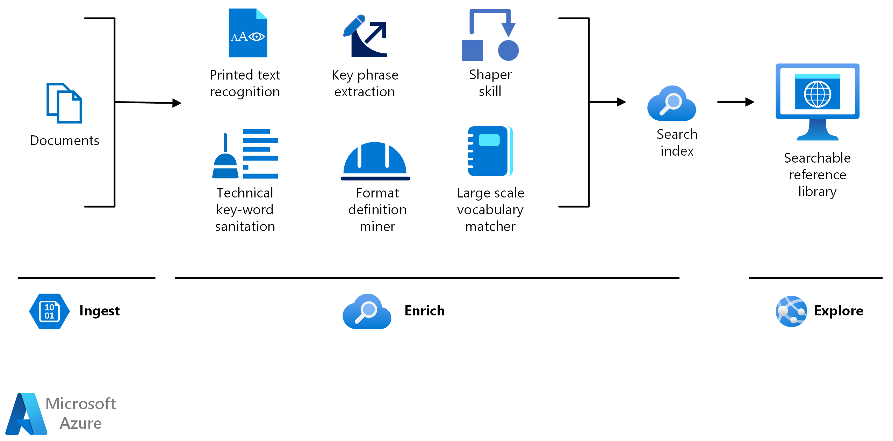

<h1>
    
    
        Conceitos Fundamentais de IA
    
</h1>

## Cargas de Trabalho Comuns de IA

### O que é inteligência artificial?

- Prever resultados e reconhecer padrões com base em dados históricos.
- Extrair informações de fontes para obter conhecimento.
- Compreender a linguagem e participar de conversas.
- Reconhecer eventos anormais e tomar decisões.
- Interpretar informações visuais.

### Machine Learning
Modelos preditivos (ação de afirmar antecipadamente o que poderá ocorrer num momento futuro) baseados em dados e estatísticas.

### Visão Computacional
Capacidade da IA para interpretar o mundo visualmente por meio de câmeras, vídeos e imagens.

### Processamento de Linguagem Natural
Capacidades da IA para que um computador interprete a linguagem escrita ou falada e responda adequadamente.

### Inteligência de Documentos
Capacidade da IA para interpretar o mundo visualmente por meio de câmeras, vídeos e imagens.

### Mineração de Conhecimento
Capacidade da IA para extrair informações de grandes volumes de dados muitas vezes não estruturados para criar um armazenamento de conhecimento pesquisável.

**
**INGERIR, ENRIQUECER E EXPLORAR**
**

### IA Generativa
Recurso de IA que criam conteúdo original em vários formatos, incluindo linguagem natural, imagem, código e muito mais.

## Princípios de IA Responsável

|                |Desafio ou Risco               |Exemplo                        |
|----------------|-------------------------------|-----------------------------|
|**Imparcialidade**|O preconceito pode afetar os resultados.|Um modelo de aprovação de empréstimo que discrimina por gênero devido ao procenceito nos dados com os quais foi treinado.            |
|**Confiabilidade e Segurança**|Erros podem causar danos.|Um veículo autônomo sofre uma falha no sistema e causa uma colisão.           |
|**Privacidade e segurança**|Dados privados podem ser expostos.|Um bot de diagnóstico médico é treinado usando dados confidenciais de pacientes, que são armazenados de forma insegura.           |
|**Inclusão**|As soluções podem não funcionar para todos.|Um aplicativo preditivo não fornece saída de áudio para usuários com deficiência visual.           |
|**Transparência**|Os usuários devem confiar em um sistema complexo.|Uma ferramenta financeira baseada em IA faz recomendações de investimento - em que se baseiam?           |
|**Responsabilidade**|Quem é responsável pelas decisões baseadas na IA?|Uma pessoa inocente é condenada por um crime com base em provas de reconhecimento facial - quem é o responsável?          |