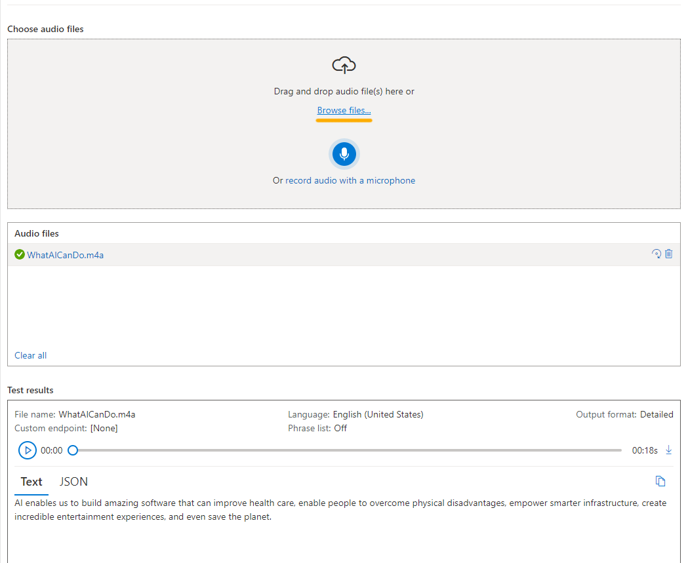

<h1>
    <a href="https://www.dio.me/">
     
    </a>
    <span>
      Análise de Sentimentos com Language Studio no Azure AI
    </span>
</h1>

### Criar um recurso de fala do Azure AI

Podemos usar o serviço de Fala criando um recurso **Speech** ou um recurso **Azure AI Services**.

**01.** Acessar o portal do [Azure AI Speech Studio](https://speech.microsoft.com/), e entrar com a conta da Microsoft 
associada à assinatura do Azure.

**02.** Selecionar **Settings** e depois **Create a resource**. Adicionar as seguintes configurações:

- **Nome do novo recurso**: Inserir um nome exclusivo.
- **Assinatura**: Minha assinatura do Azure.
- **Região**: Selecionar a região geográfica mais próxima. (Ex.:East US)
- **Nível de preços**: Free F0 (se disponível, caso contrário, selecionar Standard S0).
- **Grupo de recursos**: Selecionar ou criar um grupo de recursos com um nome exclusivo.

**03.** Selecionar **Create resource**. Aguardar até que o recurso seja criado, e selecionar **Use resource**. A página 
Introdução à Fala será exibida.

### Explorar a fala em texto no Speech Studio

**01.** Selecionar **https://aka.ms/mslearn-speech-files** para baixar o **speak.zip**. Em seguida, abrir a pasta.

**02.** Na página Introdução à fala, em Fala para texto, localizar Fala em tempo real para texto. Selecionar **Try out 
Real-time speech to text**.


**03.** Em **Choose audio files**, selecionar **Browse files** e navegar até a pasta onde baixamos o arquivo. Selecionar 
**WhatAICanDo.m4a**, e depois **Open**.



**04.** O serviço Speech transcreve e exibe o texto em tempo real. Se tivermos áudio no computador, será possível ouvir 
a gravação enquanto o texto é transcrito.

**05.** Revisar a saída, que deve ter reconhecido e transcrito com êxito o áudio em texto.

>❕**Observação**: Se receber uma mensagem de erro, aguardar alguns minutos antes de tentar novamente. Demora um pouco 
para que o recurso Fala fique disponível para o primeiro uso.

### Criar um recurso de idioma

**01.** Acessar o portal do [Azure](https://portal.azure.com), e entrar com a conta da Microsoft associada à assinatura do
Azure.

**02.** Clicar no botão **＋Create a resource** e pesquisar Serviço de idioma. Selecionar **create** um plano **Language service**.

- Seremos levados a uma página para **Select additional features**.

Manter a seleção padrão e clicar em **Continue to create your resource**.

**03.** Na página **Create Language**, adicionar as seguintes configurações:

- **Assinatura**: Minha assinatura do Azure.
- **Grupo de recursos**: Selecionar ou criar um grupo de recursos com um nome exclusivo.
- **Região**: East US.
- **Nome**: Inserir um nome exclusivo.
- **Nível de preços**: Free F0 ou S se Free F0 não estiver disponível.
- **Ao marcar esta caixa, confirmo que li e compreendi todos os termos abaixo**: Selecionado.

**04.** Selecionar **Review + create**, depois **Create**, e aguardar a conclusão da implantação.

### Configurar o recurso no Azure AI Language Studio

**01.** Acessar o [Language Studio](https://language.cognitive.azure.com).

**02.** Quando solicitado com **Select an Azure resource**, adicionar as seguintes configurações:

- **Azure directory**: Diretório padrão, o diretório que estamos usando.
- **Azure subscription**: Selecionar a assinatura que estamos usando.
- **Resource type**: Idioma
- **Resource name**: Selecionar o recurso de serviço de idioma que acabamos de criar

Em seguida, selecionar **Done**.

>❕**Importante**: A partir de julho de 2023, os serviços de IA do Azure abrangem tudo o que era anteriormente conhecido
como Serviços Cognitivos e Serviços de IA Aplicados do Azure. Algumas interfaces de usuário ainda estão atualizando suas
referências de `Cognitive Services` para `Azure AI Services`. Os dois nomes referem-se ao mesmo tipo de recurso.

>❕**Observação**: Se não for solicitado escolher um recurso de idioma, pode ser que tenhamos vários recursos de idioma
na nossa assinatura. Nesse caso:
> - Na barra na parte superior da página, selecionar **Settings**.
> - Na página **Settings**, visualizar a guia **Resources**.
> - Selecionar o recurso que acabamos de criar, e selecionar **Switch resource**. Se certificar que a identidade gerenciada
    esteja **Enabled**.
>
> 
>
> - No topo da página, selecionar **Language Studio** para retornar à página inicial do Language Studio.

### Analisar avaliações no Language Studio

**01.** Acessar o [Language Studio](https://language.cognitive.azure.com).

**02.** Na página inicial **Welcome to Language Studio**, selecionar a guia **Classify text** e, em seguida, selecionar
a guia **Analyze sentiment and mine opinions**.

**03.** Em **Select text language**, selecionar **English**.

**04.** Em **Select your Azure resource**, selecionar o nosso recurso.

**05.** Em **Enter your own text, upload a file, or use one of our sample texts**, copiar e colar a seguinte revisão:

```code
 Tired hotel with poor service
 The Royal Hotel, London, United Kingdom
 5/6/2018
 This is an old hotel (has been around since 1950's) and the room furnishings are average - becoming a bit old now and 
 require changing. The internet didn't work and had to come to one of their office rooms to check in for my flight home. 
 The website says it's close to the British Museum, but it's too far to walk.
```

**06.** Marcar a caixa para confirmar que a demonstração incorrerá em uso e poderá incorrer em custos, e selecionar **Run**.

**07.** Revisar a saída. Observar que o documento é analisado quanto ao sentimento, assim como cada frase. Selecionar a
Frase 1 para mostrar a análise de sentimento dessa frase.

> Observar que há um sentimento geral seguido por pontuações próximas a três categorias: pontuação positiva, pontuação
neutra e pontuação negativa. Em cada uma das categorias é atribuída uma pontuação entre 0 e 1. Essas pontuações de
confiança indicam a probabilidade do texto fornecido ser um sentimento específico.

#### Selecionar a frase 1 novamente para fechar.

**01.** Rolar para cima para selecionar **Clear text box**, e copiar e colar a seguinte revisão:

```code
 Good Hotel and staff
 The Royal Hotel, London, UK
 3/2/2018
 Clean rooms, good service, great location near Buckingham Palace and Westminster Abbey, and so on. We thoroughly enjoyed 
 our stay. The courtyard is very peaceful and we went to a restaurant which is part of the same group and is Indian (West 
 coast so plenty of fish) with a Michelin Star. We had the taster menu which was fabulous. The rooms were very well appointed 
 with a kitchen, lounge, bedroom and enormous bathroom. Thoroughly recommended.
```

**02.** Selecionar **Run**. Revisar o resultado, o sentimento, e o nível de confiança.

**03.** Selecionar **Clear text** novamente e copiar e colar a seguinte revisão:

>❕Very noisy and rooms are tiny The Lombard Hotel, San Francisco, USA 9/5/2018 Hotel is located on Lombard street which
is a very busy SIX lane street directly off the Golden Gate Bridge. Traffic from early morning until late at night especially
on weekends. Noise would not be so bad if rooms were better insulated but they are not. Had to put cotton balls in my ears
to be able to sleep–was too tired to enjoy the city the next day. Rooms are TINY. I picked the room because it had two queen
size beds–but the room barely had space to fit them. With family of four in the room it was tight. With all that said, rooms
are clean and they’ve made an effort to update them. The hotel is in Marina district with lots of good places to eat, within
walking distance to Presidio. May be good hotel for young stay-up-late adults on a budget.

**04.** Selecionar **Run** e analisar o sentimento juntamente com o nível de confiança. Dar uma olhada no texto e comparar
com a análise de sentimento que o serviço retornou.

### Limpar

Excluir todos os recursos que não forem mais necessários para evita acumular custos desnecessários.

**01.** Acessar o portal do [Azure](https://portal.azure.com), e selecionar o grupo de recursos que contém o recurso que foi criado para o exercício.

**02.** Selecionar o recurso, selecionar **Delete**, e depois **Yes** para confirmar. O recurso é então excluído.