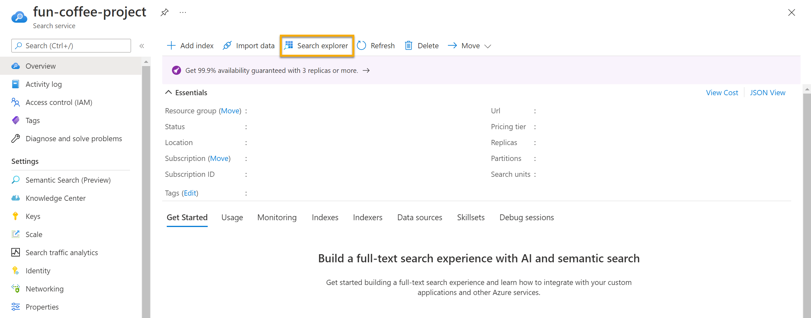
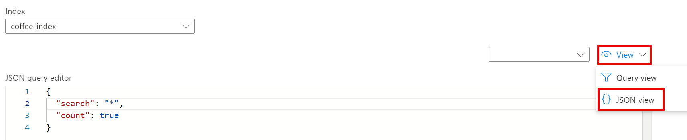

<h1>
    <a href="https://www.dio.me/">
     
    </a>
    <span>
      Azure Cognitive Search: Utilizando AI Search para indexação e consulta de Dados
    </span>
</h1>

### Recursos do Azure necessários

A solução que iremos criar para o Fourth Coffee requer os seguintes recursos na assinatura do Azure:

- Um recurso **Azure AI Search**, que gerenciará a indexação e a consulta.
- Um recurso **Azure AI Services**, que fornece serviços de IA para habilidades que a solução de pesquisa pode usar para enriquecer os dados na fonte de dados com insights gerados por IA.

>❕**Observação**: Os recursos do Azure AI Search e dos serviços Azure AI devem estar no mesmo local.

- Uma **Storage account** com contêineres de blobs, que armazenará documentos brutos e outras coleções de tabelas, objetos ou arquivos.

### Criar um recurso do Azure AI Search

**01.** Acessar o polta do [Azure](https://portal.azure.com/learn.docs.microsoft.com?azure-portal=true).

**02.** Clicar no botão **+ Create a resource**, pesquisar `Azure AI Search` e criar um recurso **Azure AI Search** com as seguintes configurações:

- **Assinatura**: Minha assinatura do Azure.
- **Grupo de recursos**: Selecionar ou criar um grupo de recursos com um nome exclusivo.
- **Nome do serviço**: Inserir um nome exclusivo.
- **Localização**: Escolher qualquer região disponível.
- **Nível de preços**: Básico.

**03.** Selecionar **Review + Create**, e depois de ver a resposta **Validation Success**, selecionar **Create**.

**04.** Após a conclusão da implantação, selecionar **Ir para o recurso**. Na página de visão geral do Azure AI Search, podemos adicionar índices, importar dados e pesquisar índices criados.

### Criar um recurso de serviços de IA do Azure

Devemos provisionar um recurso **Azure AI services** que esteja no mesmo local que o recurso do Azure AI Search. Nossa solução de pesquisa usará esse recurso para enriquecer os dados no armazenamento de dados com insights gerados por IA.

**01.** Retornar à página inicial do portal do Azure. Clicar no botão **＋Criar um recurso** e pesquisar os serviços de `IA do Azure`. Selecionar **criar** um plano **de serviços de IA do Azure**.

- Seremos levados a uma página para criar um recurso de serviços de IA do Azure.

Adicionar as seguintes configurações:

- **Assinatura**: Minha assinatura do Azure.
- **Grupo de recursos**: O mesmo grupo de recursos que o nosso recurso do Azure AI Search.
- **Região**: O mesmo local que o nosso recurso do Azure AI Search.
- **Nome**: Inserir um nome exclusivo.
- **Nível de preços**: Standard S0.
- **Ao marcar esta caixa, confirmo que li e compreendi todos os termos abaixo**: Selecionado.

**02.** Selecionar **Review + Create**, e depois de ver a resposta **Validation Success**, selecionar **Create**.

**03.** Aguardar a conclusão da implantação, e após visualizar os detalhes da implantação.

### Criar uma conta de armazenamento

**01.** Retornar à página inicial do portal do Azure e selecione o botão **+ Create a resource**.

**02.** Procurar a conta de armazenamento e criar um recurso **Storage account** com as seguintes configurações:

- **Assinatura**: Minha assinatura do Azure.
- **Grupo de recursos**: O mesmo grupo de recursos que o nosso recurso do Azure AI Search e dos serviços Azure IA.
- **Nome da conta de armazenamento**: Inserir um nome exclusivo.
- **Localização**: Escolher qualquer região disponível.
- **Padrão de desempenho**: Standard.
- **Redundância**: Locally Redundant Storage (LRS).

**03.** Clicar em **Review** e em **Create**. Aguardar a conclusão da implantação, e ir para o recurso implantado.

**04.** Na conta de Armazenamento do Azure que criamos, no painel de menu esquerdo, selecionar **Configuration** (em **Settings**).

**05.** Alterar a configuração de **Allow Blob anonymous access** para **Enabled** e selecionar **Save**.

### Carregar documentos para o armazenamento do Azure

**01.** No painel do menu esquerdo, selecionar **Containers**.


**02.** Selecionar **+ Container**. Um painel do lado direito será aberto.

**03.** Inserir as seguintes configurações, e clicar em **Create**:

- **Nome**: Coffee-Reviews.
- **Nível de acesso público**: Container (acesso de leitura anônimo para containers e blobs).
- **Avançado**: Sem alterações.

**04.** Em uma nova guia do navegador, baixar as avaliações de café em https://aka.ms/mslearn-coffee-reviews, e extrair os arquivos para a pasta de avaliações.

**05.** No portal do Azure, selecionar o contêiner de avaliações de café. No contêiner, selecionar **Upload**.


**06.** No painel **Upload blob**, selecionar **Select a file**.

**07.** Na janela do Explorer, selecionar todos os arquivos na pasta de avaliações, selecionar **Open** e, em seguida, selecionar **Upload**.


**08.** Depois que o upload for concluído, podemos fechar o painel **Upload blob**. Nossos documentos estão agora no nosso contêiner de armazenamento de avaliações de café.

### Indexar os documentos

Depois de armazenar os documentos, podemos usar o Azure AI Search para extrair insights dos documentos. O portal do Azure fornece um assistente de importação de dados. Com este assistente, podemos criar automaticamente um índice e um indexador para fontes de dados suportadas. Utilizaremos o assistente para criar um índice e importar os documentos de pesquisa do armazenamento para o índice do Azure AI Search.

**01.** No portal do Azure, navegar até o recurso Azure AI Search. Na página **Overview**, selecionar **Import data**.


**02.** Na página **Connect to your data**, na lista **Data Source**, selecionar **Azure Blob Storage**. Preencher os detalhes do armazenamento de dados com os seguintes valores:

- **Fonte de dados**: Azure Blob Storage
- **Nome da fonte de dados**: coffee-customer-data
- **Dados a extrair**: Content and metadata
- **Modo de análise**: Default
- **Cadeia de conexão**: *Selecionar **Choose an existing connection**. Selecionar a conta de armazenamento, selecionar o contêiner **coffee-reviews** e clicar em **Select**.
- **Autenticação de identidade gerenciada**: Nenhuma
- **Nome do contêiner**: Esta configuração é preenchida automaticamente depois que escolhemos uma conexão existente.
- **Pasta Blob**: Deixar em branco.
- **Descrição**: Avaliações sobre Fourth Coffee Shops.

**03.** Selecionar **Next: Add cognitive skills (Optional)**.

**04.** Na secção **Attach Cognitive Services**, selecionar o recurso de serviços Azure AI.

**05.** Na seção **Add enrichments**:

- Alterar o **Skillset name** para **coffee-skillset**.
- Marcar a caixa de seleção **Enable OCR and merge all text into merged_content field**.

>❕**Observação**: É importante selecionar **Enable OCR** para ver todas as opções de campo enriquecido.

- Se certificar que o **Source data field** esteja configurado como **merged_content**.
- Alterar o **Enrichment granularity level** para **Pages (5000 character chunks)**.
- Não selecionar Habilitar enriquecimento incremental.
- Selecionar os seguintes campos enriquecidos:

    Habilidade Cognitiva | Parâmetro | Nome do campo
      -------------------- | --------- | -------------
    Extraia nomes de locais |  | Localizações
    Extraia frases-chave | | Frases chave
    Detectar sentimento | | Sentimento
    Gerar tags de imagens | | ImagemTags
    Gere legendas de imagens | | Legenda da imagem

**06.** Em **Save enrichments to a knowledge store**, selecionar:

- Projeções de imagem.
- Documentos.
- Páginas.
- Frases chave.
- Entidades.
- Detalhes da imagem.
- Referências de imagem.

>❕**Observação**: Se aparecer um aviso solicitando uma **Storage Account Connection String**.
> 
> 
>
>  **a.** Selecionar **Choose an existing connection**. Escolher a conta de armazenamento que criamos anteriormente.
> 
>  **b.** Clicar em **+ Container** para criar um novo contêiner chamado **knowledge-store** com o nível de privacidade definido como **Private** e selecionar **Create**.
>
>  **c.** Selecionar o contêiner **knowledge-store** e clicar em **Select** na parte inferior da tela.

**07.** Selecionar **Azure blob projections: Document**. Uma configuração para o nome do contêiner com as exibições preenchidas automaticamente do contêiner de armazenamento de conhecimento. Não alterar o nome do contêiner.

**08.** Selecionar **Next: Customize target index**. Altere o **Index name** para **coffee-index**.

**09.** Se certificar de que a **Key** esteja configurada como **metadata_storage_path**. Deixar **Suggester name** em branco e **Search mode** preenchido automaticamente.

**10.** Revisar as configurações padrão dos campos de índice. Selecionar **filterable** para todos os campos que já estão selecionados por padrão.


**11.** Selecionar **Next: Create an indexer**.

**12.** Alterar o **Indexer name** para **coffee-indexer**.

**13.** Deixar a **Schedule** definida como **Once**.

**14.** Expandir as **Advanced options**. Se certificar de que a opção **Base-64 Encode Keys** esteja selecionada, pois as chaves de codificação podem tornar o índice mais eficiente.

**15.** Selecionar **Submit** para criar a fonte de dados, o conjunto de habilidades, o índice e o indexador. O indexador é executado automaticamente e executa o pipeline de indexação, que:
- Extrai os campos de metadados do documento e o conteúdo da fonte de dados.
- Executa o conjunto de habilidades cognitivas para gerar campos mais enriquecidos.
- Mapeia os campos extraídos para o índice.

**16.** Voltar à página de recursos do Azure AI Search. No painel esquerdo, em **Search Management**, selecionar **Indexers**. Selecionar o **coffee-indexer** recém-criado. Esperar um minuto e selecionar **↻ Refresh** até que o **Status** indique sucesso.

**17.** Selecione o nome do indexador para ver mais detalhes.


### Consultar o índice

Usar o Search Explorer para escrever e testar consultas. O explorador de pesquisa é uma ferramenta incorporada no portal do Azure que oferece uma maneira fácil de validar a qualidade do índice de pesquisa. Podemos usar o Search Explorer para escrever consultas e revisar resultados em JSON.

**01.** Na página Visão geral do serviço de pesquisa , selecionar **Search explorer** na parte superior da tela.



**02.** Observar se o índice selecionado é o **coffee-index** que criamos. Abaixo do índice selecionado, alterar a visualização para **JSON view**.



No campo **JSON query editor**, copiar e colar:

```JSON
{
    "search": "*",
    "count": true
}
```

**01.** Selecionar **Search**. A consulta de pesquisa retorna todos os documentos no índice de pesquisa, incluindo uma contagem de todos os documentos no campo **@odata.count**. O índice de pesquisa deve retornar um documento JSON contendo os resultados da pesquisa.

**02.** Agora vamos filtrar por localização. No campo **JSON query editor**, copiar e colar:

 ```JSON
{
 "search": "locations:'Chicago'",
 "count": true
}
```

**03.** Selecionar **Search**. A consulta pesquisa todos os documentos no índice e filtra revisões com localização em Chicago. Devemos ver `3` no campo `@odata.count`.

**04.** Agora vamos filtrar por sentimento. No campo **JSON query editor**, copiar e colar:

 ```JSON
{
 "search": "sentiment:'negative'",
 "count": true
}
```

**05.** Selecionar **Search**. A consulta pesquisa todos os documentos no índice e filtra revisões com sentimento negativo. Devemos ver `1` no campo `@odata.count`.

>❕**Observação**: Observar como os resultados são classificados por `@search.score`. Esta é a pontuação atribuída pelo mecanismo de pesquisa para mostrar o quão próximos os resultados correspondem à consulta fornecida.

**06.** Um dos problemas que podemos querer resolver é o por que de certas avaliações. Vamos dar uma olhada nas frases-chave associadas à avaliação negativa.

### Revisar o armazenamento de conhecimento

Vamos ver o poder do armazenamento de conhecimento em ação. Ao executar o assistente Importar dados, criamos também um armazenamento de conhecimento. Dentro do armazenamento de conhecimento, encontraremos os dados enriquecidos extraídos pelas habilidades de IA que persistem na forma de projeções e tabelas.

**01.** No portal do Azure, navegar de volta para a conta de armazenamento do Azure.

**02.** No painel do menu esquerdo, selecionar **Containers**. Selecionar o contêiner **knowledge-store**.


**03.** Selecionar qualquer um dos itens e clicar no arquivo **objectprojection.json**.


**04.** Selecionar **Edit** para ver o JSON produzido para um dos nossos documentos de armazenamento de dados do Azure.


**05.** Selecionar a localização atual do blob de armazenamento no canto superior esquerdo da tela para retornar à conta de armazenamento Containers.


**06.** Em Containers, selecionar o contêiner coffee-skillset-image-projection. Selecionar qualquer um dos itens.


**07.** Selecionar qualquer um dos arquivos .jpg. Selecionar **Edit** para ver a imagem armazenada no documento. Observar como todas as imagens dos documentos são armazenadas desta forma.


**08.** Selecionar a localização atual do blob de armazenamento no canto superior esquerdo da tela para retornar à conta de armazenamento Containers.

**09.** Selecionar **Storage browser** no painel esquerdo e selecionar **Tables**. Há uma tabela para cada entidade no índice. Selecionar a tabela coffeeSkillsetKeyPhrases.

Observar as frases-chave que o armazenamento de conhecimento conseguiu capturar do conteúdo das avaliações. Muitos dos campos são chaves, portanto podemos vincular as tabelas como um banco de dados relacional. O último campo mostra as frases-chave que foram extraídas pelo conjunto de habilidades.


