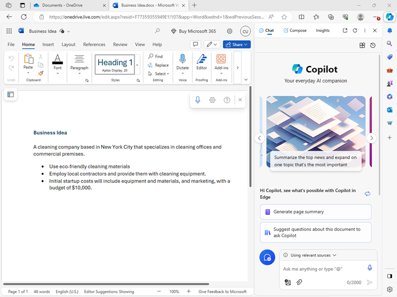
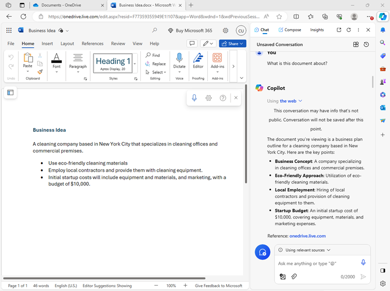
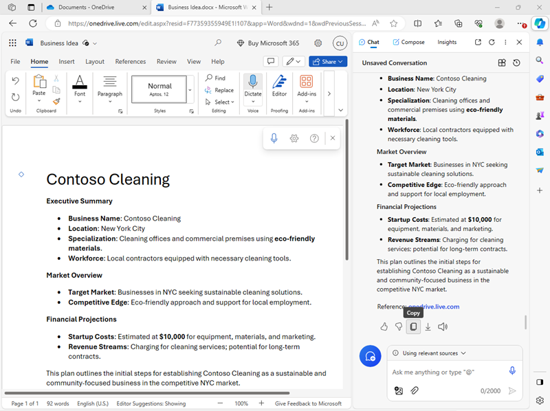
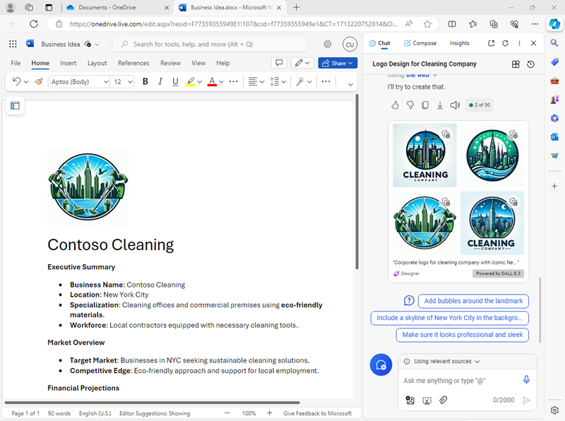
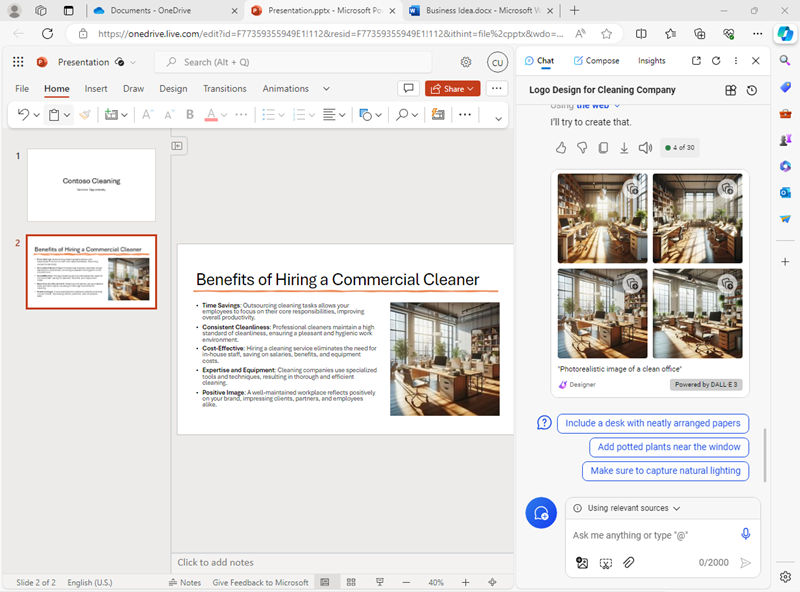
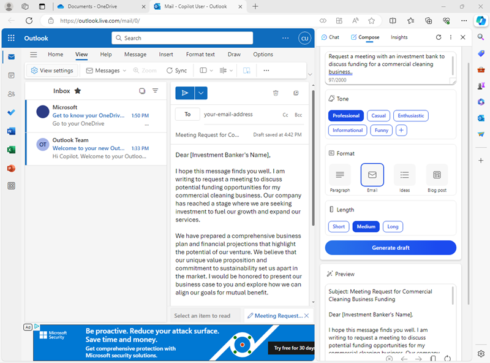

<h1>
    <a href="https://www.dio.me/">
     
    </a>
    <span>
      Explorando os Recursos de IA Generativa com Copilot e OpenAI
    </span>
</h1>

### Usar o Copilot para explorar um documento e pesquisar uma ideia

Para começarmos a explorar a IA generativa, vamos usar o Microsoft Copilot no Edge para examinar um documento existente e extrair dele alguns insights.

**01.** No Microsoft Edge, navegar até o [OneDrive](https://onedrive.live.com) e fazer login usando uma conta pessoal da Microsoft – fechando todas as mensagens de boas-vindas ou ofertas exibidas.

**02.** Em outra aba do navegador, abrir o documento [Business Idea.docx](https://github.com/MicrosoftLearning/mslearn-ai-fundamentals/raw/main/data/generative-ai/Business%20Idea.docx). Em seguida, quando o documento abrir no Edge, selecionar a opção **Save a copy to OneDrive**, e salvar o documento na pasta **Documents** do OneDrive. O documento deve então abrir automaticamente no Microsoft Word online.

>❕**Observação**: Caso não apareça a opção de salvar uma cópia do arquivo no OneDrive, baixar o arquivo no computador. Em seguida, no OneDrive, abrir a pasta **Documents** e usar o botão **+ Add new** para carregar o arquivo **Business Idea.docx** do computador local para o OneDrive.

**03.** Ver o texto **Business Idea.docx**, que descreve algumas ideias de alto nível para uma empresa de limpeza na cidade de Nova York.

**04.** Usar o ícone do **Copilot** na barra de ferramentas do Edge para abrir o painel do Copilot, conforme mostrado aqui:



**05.** No painel Copilot, rolar para baixo para ver todo o conteúdo conforme necessário e se certificar de que a guia **Chat** esteja selecionada e que o estilo de conversa esteja definido como **More Balanced** - isso garantirá que o Copilot responda com um equilíbrio entre criatividade e precisão factual.

**06.** Na caixa de bate-papo na parte inferior do painel Copilot, digitar seguindo o prompt:

```CODE
 What is this document about?
```

Se solicitado, confirmar que deseja permitir que o Copilot acesse a página e confirmar que a conversa não será salva (observar que o Copilot protege a privacidade da conversa porque ele inclui informações de um documento pessoal em seu OneDrive).

**07.** Revisar a resposta do Copilot, que deve resumir os principais pontos do documento, conforme mostrado aqui:



>❕**Observação**: A resposta específica pode variar.

**08.** Digitar o seguinte prompt:

```CODE
 What's the market opportunity for this business idea?
```

**09.** Revisar a resposta, que deve fornecer alguns insights da Web que podem ser úteis ao planejar um novo negócio de limpeza em Nova York.

**10.** Digitar o seguinte prompt:

```CODE
 How do I go about setting up a business in New York?
```

**11.** Revisar a resposta, que deve conter alguns conselhos e links de recursos para nos ajudar a abrir um negócio em Nova York, e pode incluir algumas sugestões para obtermos mais informações.

>❕**Importante**: A resposta gerada pela IA é baseada em informações públicas na Web. Embora possa ser útil para nos ajudar a compreender as etapas necessárias para abrir uma empresa, não há garantia de que seja 100% preciso e não substitui a necessidade de aconselhamento profissional!

### Usar o Copilot para criar conteúdo para um plano de negócios

Agora que fizemos algumas pesquisas iniciais, vamos pedir ao Copilot para nos ajudar a desenvolver um plano de negócios para nossa empresa de limpeza.

**01.** Com o documento **Business Idea.docx** ainda aberto no Microsoft Edge, no painel Copilot, inserir o seguinte prompt:

```CODE
 Suggest a name for my cleaning business
```

**02.** Revisar as sugestões e selecionar um nome para a nossa empresa de limpeza (ou continuar solicitando para encontrar um nome de nossa preferência).

**03.** Inserir o seguinte prompt, substituindo Contoso Cleaning pelo nome da empresa de nossa escolha:

```CODE
 Write a business plan for "Constoso Cleaning" based on the information in this document. Include an executive summary, market overview, and financial projections.
```

**04.** Revisar a resposta e, na saída, usar o ícone **Copy** (🗍) para copiá-la para a área de transferência. Em seguida, selecionar todo o texto no documento **Business Ideas.docx** e colar o texto copiado no documento para substituí-lo. Por fim, arrumar o texto colado substituindo o texto inicial da resposta (em que o Copilot reconheceu a instrução) por um título para o nome da nossa empresa de limpeza. Devemos acabar com um documento de plano de negócios semelhante a este:



**05.** No painel Copilot, inserir o seguinte prompt:

```CODE
 Create a corporate logo for the cleaning company. The logo should be round and include an iconic New York landmark.
```

**06.** Revisar a resposta, que deverá apresentar quatro opções de logotipo criado pelo Microsoft Designer.

**07.** Usar mais prompts para iterar no design (por exemplo, `Make it green and blue`) até ter um logotipo que nos agrade.

**08.** Clicar com o botão direito no design do logotipo de nossa preferência e copiar para a área de transferência. Em seguida, colar no topo do documento do plano de negócios, assim:



**09.** Fechar a guia Microsoft Word e retornar à pasta **Documents** no OneDrive.

### Usar o Copilot para criar conteúdo para uma apresentação

Com a ajuda do Copilot, criamos um rascunho de plano de negócios para a ideia de negócio de limpeza. Agora precisamos de uma apresentação eficaz para convencer um investidor a nos emprestar o financiamento para iniciar o negócio.

**01.** Na pasta **Documents** do OneDrive, adicionar uma nova **PowerPoint presentation**. Se o painel **Designer** abrir automaticamente, fechar.

**02.** No slide de título da apresentação, inserir o nome da nossa empresa de limpeza como título e `Investor Opportunity** como subtítulo.

**03.** Adicionar um novo slide usando o layout de slide **Two Content** (que inclui um título e dois espaços reservados para conteúdo).

**04.** Alterar o título do slide para `Benefits of Hiring a Commercial Cleaner`.

**05.** No painel Copilot, inserir o seguinte prompt:

```CODE
 Write a summary of the benefits of using a corporate cleaning company for your business. The summary should consist of five short bullet points.
```

**06.** Copiar a resposta do Copilot para a área de transferência e colar no espaço reservado para conteúdo à esquerdo. Em seguida, excluir a frase inicial confirmando a solicitação e reformatar o texto no espaço reservado até ficar satisfeito.

**07.** No painel Copilot, inserir o seguinte prompt:

```CODE
 Create a photorealistic image of a clean office.
```

**08.** Quando o Copilot gerar uma imagem de nossa preferência, copiar para a área de transferência e colar no espaço reservado de conteúdo à direita do slide.

Se o painel **Designer** abrir automaticamente, selecionar um design de slide de nossa preferência. Em seguida, fechar o painel **Designer**.

**09.** Aplicar qualquer reformatação adicional que acharmos necessária até obtermos um slide semelhante a este:



**10.** Na barra de título do PowerPoint, selecionar o nome padrão da apresentação (**Presentation**) e renomear para `Business Presentation.pptx`.

**11.** Fechar a guia PowerPoint e retornar à pasta **Documents** no OneDrive.

### Usar o Copilot para escrever um e-mail

Criamos alguns materiais para nos ajudar a iniciar um negócio. Agora é hora de entrar em contato com um investidor em busca de financiamento para uma startup.

**01.** Usar o **App Launcher** na extremidade esquerda da barra de título do OneDrive para abrir o **Outlook**.

**02.** Criar um novo e-mail e preencher a caixa **To** com nosso próprio endereço de e-mail.

**03.** No painel Copilot, selecionar a guia **Compose**. Em seguida, definir as seguintes opções para compormos novos conteúdos:
- **Escreva sobre**: `Request a meeting with an investment bank to discuss funding for a commercial cleaning business.`
- **Tom**: Professional.
- **Formato**: Email.
- **Comprimento**: Medium.

**04.** Selecionar **Generate draft** e revisar a saída gerada.

**05.** Usar o conteúdo gerado para completar nosso e-mail, conforme mostrado aqui:



Podemos enviar o e-mail para nós mesmos, caso desejarmos!